# 🏗️ Sanjivani AI - System Architecture

> **Multimodal Crisis Intelligence System for Flood Disaster Response in Bihar, India**

---

## 📋 Table of Contents

1. [System Overview](#system-overview)
2. [High-Level Architecture](#high-level-architecture)
3. [Core Modules](#core-modules)
   - [NLP Module](#nlp-module)
   - [Vision Module](#vision-module)
   - [Forecasting Module](#forecasting-module)
4. [API Layer](#api-layer)
5. [Dashboard](#dashboard)
6. [Data Layer](#data-layer)
7. [Infrastructure](#infrastructure)
8. [Technology Stack](#technology-stack)
9. [Data Flow](#data-flow)

---

## System Overview

Sanjivani AI is a production-ready crisis intelligence platform that combines **Natural Language Processing**, **Computer Vision**, and **Time-Series Forecasting** to support flood disaster response operations in Bihar, India. The system processes real-time social media distress signals, analyzes satellite imagery for flood extent detection, and predicts resource requirements for emergency response.

### Key Capabilities

| Capability | Description | Model |
|------------|-------------|-------|
| **Tweet Classification** | Multi-label crisis urgency, resource needs, and vulnerability detection | DistilBERT |
| **Flood Segmentation** | Satellite imagery analysis for flood extent mapping | U-Net + ResNet50 |
| **Object Detection** | Identify stranded people, vehicles, and infrastructure | YOLOv8 |
| **Resource Forecasting** | Predict resource requirements for affected districts | XGBoost + LSTM Ensemble |

---

## High-Level Architecture

```mermaid
flowchart TB
    subgraph Data Sources
        TW["🐦 Twitter<br/>API"]
        SAT["🛰️ Sentinel-2<br/>Satellite"]
        HIST["📊 Historical<br/>Flood Data"]
    end

    subgraph Ingestion Layer
        TS["Twitter<br/>Streamer"]
        SD["Satellite<br/>Downloader"]
        DL["Data<br/>Loaders"]
    end

    subgraph ML Pipeline
        NLP["🔤 NLP Module<br/>DistilBERT"]
        VIS["🖼️ Vision Module<br/>U-Net + YOLOv8"]
        FORE["📈 Forecasting<br/>XGBoost + LSTM"]
    end

    subgraph API Layer
        API["⚡ FastAPI<br/>REST API"]
    end

    subgraph Storage
        DB["🗄️ PostgreSQL<br/>+ PostGIS"]
        REDIS["⚡ Redis<br/>Cache"]
        FS["📁 File Storage<br/>Models & Data"]
    end

    subgraph Presentation
        DASH["📊 Streamlit<br/>Dashboard"]
        DOCS["📖 OpenAPI<br/>Docs"]
    end

    TW --> TS --> NLP
    SAT --> SD --> VIS
    HIST --> DL --> FORE

    NLP --> API
    VIS --> API
    FORE --> API
    
    API --> DB
    API --> REDIS
    
    API --> DASH
    API --> DOCS
```



---

## Core Modules

### NLP Module

**Location:** `src/nlp/`

The NLP module processes crisis-related tweets using a fine-tuned DistilBERT model for multi-label classification and location extraction.


#### Components

| File | Purpose |
|------|---------|
| [`model.py`](file:///Volumes/Aditya%20ssd/sanjivani-ai/src/nlp/model.py) | DistilBERT multi-label classifier with urgency, resource, and vulnerability heads |
| [`preprocessing.py`](file:///Volumes/Aditya%20ssd/sanjivani-ai/src/nlp/preprocessing.py) | Text cleaning, transliteration, normalization |
| [`location_extractor.py`](file:///Volumes/Aditya%20ssd/sanjivani-ai/src/nlp/location_extractor.py) | Bihar district and location extraction from text |
| [`inference.py`](file:///Volumes/Aditya%20ssd/sanjivani-ai/src/nlp/inference.py) | Production inference engine with caching |
| [`pipeline.py`](file:///Volumes/Aditya%20ssd/sanjivani-ai/src/nlp/pipeline.py) | Complete end-to-end NLP pipeline |
| [`train.py`](file:///Volumes/Aditya%20ssd/sanjivani-ai/src/nlp/train.py) | Training loop with evaluation |
| [`evaluate.py`](file:///Volumes/Aditya%20ssd/sanjivani-ai/src/nlp/evaluate.py) | Model evaluation metrics |
| [`dataset.py`](file:///Volumes/Aditya%20ssd/sanjivani-ai/src/nlp/dataset.py) | PyTorch dataset for tweet data |

#### Classification Labels

```python
URGENCY_CLASSES = ["Critical", "High", "Medium", "Low", "Non-Urgent"]
RESOURCE_CLASSES = ["Rescue", "Medical", "Food", "Shelter", "Information", "Water"]
VULNERABILITY_CLASSES = ["Elderly", "Children", "Disabled", "Pregnant", "None"]
```

---

### Vision Module

**Location:** `src/vision/`

The Vision module analyzes satellite imagery using deep learning for flood extent segmentation and object detection.


#### Components

| File | Purpose |
|------|---------|
| [`segmentation.py`](file:///Volumes/Aditya%20ssd/sanjivani-ai/src/vision/segmentation.py) | U-Net model with ResNet50 encoder for flood extent |
| [`detection.py`](file:///Volumes/Aditya%20ssd/sanjivani-ai/src/vision/detection.py) | YOLOv8 wrapper for object detection |
| [`change_detection.py`](file:///Volumes/Aditya%20ssd/sanjivani-ai/src/vision/change_detection.py) | Pre/post flood change analysis |
| [`inference.py`](file:///Volumes/Aditya%20ssd/sanjivani-ai/src/vision/inference.py) | Production vision inference engine |
| [`preprocessing.py`](file:///Volumes/Aditya%20ssd/sanjivani-ai/src/vision/preprocessing.py) | Image preprocessing utilities |
| [`dataset.py`](file:///Volumes/Aditya%20ssd/sanjivani-ai/src/vision/dataset.py) | PyTorch dataset for satellite imagery |
| [`train_segmentation.py`](file:///Volumes/Aditya%20ssd/sanjivani-ai/src/vision/train_segmentation.py) | Segmentation model training |
| [`train_detection.py`](file:///Volumes/Aditya%20ssd/sanjivani-ai/src/vision/train_detection.py) | Detection model training |

#### Segmentation Classes

```python
SEGMENTATION_CLASSES = ["background", "water", "cloud"]
```

---

### Forecasting Module

**Location:** `src/forecasting/`

The Forecasting module predicts resource requirements using an ensemble of XGBoost (spatial features) and LSTM (temporal sequences).


#### Components

| File | Purpose |
|------|---------|
| [`ensemble.py`](file:///Volumes/Aditya%20ssd/sanjivani-ai/src/forecasting/ensemble.py) | Weighted ensemble combining XGBoost and LSTM |
| [`xgboost_model.py`](file:///Volumes/Aditya%20ssd/sanjivani-ai/src/forecasting/xgboost_model.py) | XGBoost regressor for spatial features |
| [`lstm_model.py`](file:///Volumes/Aditya%20ssd/sanjivani-ai/src/forecasting/lstm_model.py) | LSTM network for temporal sequences |
| [`feature_engineering.py`](file:///Volumes/Aditya%20ssd/sanjivani-ai/src/forecasting/feature_engineering.py) | Feature extraction and transformation |
| [`inference.py`](file:///Volumes/Aditya%20ssd/sanjivani-ai/src/forecasting/inference.py) | Production forecasting inference |
| [`train.py`](file:///Volumes/Aditya%20ssd/sanjivani-ai/src/forecasting/train.py) | Training pipeline |

#### Resource Outputs

```python
RESOURCE_OUTPUTS = ["food_packets", "medical_kits", "rescue_boats", "shelters"]
```

---

## API Layer

**Location:** `src/api/`

The FastAPI backend provides a RESTful API with OpenAPI documentation, CORS support, and structured routing.


### API Structure

```
src/api/
├── main.py              # FastAPI app initialization
├── middleware/          # CORS, authentication, logging
├── routes/
│   ├── health.py        # Health check endpoints
│   ├── nlp.py           # Tweet analysis endpoints
│   ├── vision.py        # Image analysis endpoints
│   └── forecasting.py   # Resource forecast endpoints
└── schemas/             # Pydantic request/response models
```

### Endpoints

| Endpoint | Method | Description |
|----------|--------|-------------|
| `/health` | GET | System health check |
| `/api/v1/analyze-tweet` | POST | Classify crisis tweet |
| `/api/v1/analyze-image` | POST | Analyze satellite image |
| `/api/v1/forecast/{district}` | GET | Get resource forecast |
| `/api/v1/districts` | GET | List Bihar districts |
| `/docs` | GET | OpenAPI documentation |
| `/redoc` | GET | ReDoc documentation |

---

## Dashboard

**Location:** `src/dashboard/`

The Streamlit dashboard provides real-time crisis monitoring with interactive maps and visualizations.

### Features

- **District Overview**: Active alerts, affected population, resource deployment
- **Resource Forecasting**: Configurable horizon predictions by district
- **Tweet Analysis**: Real-time tweet classification interface
- **Crisis Map**: Interactive map with alert locations

### Components

```
src/dashboard/
├── app.py               # Main Streamlit application
└── components/          # Reusable UI components
```

---

## Data Layer

**Location:** `src/data/`

The data layer provides database models, connection management, and data loading utilities.


### Components

| File | Purpose |
|------|---------|
| [`models.py`](file:///Volumes/Aditya%20ssd/sanjivani-ai/src/data/models.py) | SQLAlchemy ORM models with PostGIS support |
| [`database.py`](file:///Volumes/Aditya%20ssd/sanjivani-ai/src/data/database.py) | Database connection management (sync/async) |
| [`loaders.py`](file:///Volumes/Aditya%20ssd/sanjivani-ai/src/data/loaders.py) | Data loading and preprocessing utilities |
| [`twitter_streamer.py`](file:///Volumes/Aditya%20ssd/sanjivani-ai/src/data/twitter_streamer.py) | Twitter API v2 streaming client |
| [`satellite_downloader.py`](file:///Volumes/Aditya%20ssd/sanjivani-ai/src/data/satellite_downloader.py) | Sentinel Hub satellite imagery downloader |
| [`split_dataset.py`](file:///Volumes/Aditya%20ssd/sanjivani-ai/src/data/split_dataset.py) | Train/val/test splitting utilities |

---

## Infrastructure

### Docker Architecture


### Container Configuration

| Service | Image | Port | Purpose |
|---------|-------|------|---------|
| `api` | Custom | 8000 | FastAPI backend |
| `dashboard` | Custom | 8501 | Streamlit UI |
| `db` | `postgis/postgis:15-3.3` | 5432 | PostgreSQL + PostGIS |
| `redis` | `redis:7-alpine` | 6379 | Caching layer |

### Dockerfiles

- [`docker/Dockerfile.api`](file:///Volumes/Aditya%20ssd/sanjivani-ai/docker/Dockerfile.api) - API service container
- [`docker/Dockerfile.dashboard`](file:///Volumes/Aditya%20ssd/sanjivani-ai/docker/Dockerfile.dashboard) - Dashboard container
- [`docker/Dockerfile.train`](file:///Volumes/Aditya%20ssd/sanjivani-ai/docker/Dockerfile.train) - Training environment

---

## Technology Stack

### Core Framework

| Category | Technology | Version |
|----------|------------|---------|
| **Language** | Python | 3.10+ |
| **Web Framework** | FastAPI | 0.104.1 |
| **Dashboard** | Streamlit | 1.28.2 |
| **Configuration** | Pydantic Settings | 2.1.0 |

### Machine Learning

| Category | Technology | Version |
|----------|------------|---------|
| **Deep Learning** | PyTorch | 2.1.2 |
| **NLP** | Transformers (DistilBERT) | 4.35.2 |
| **CV Segmentation** | segmentation-models-pytorch | 0.3.3 |
| **Object Detection** | Ultralytics YOLOv8 | 8.0.227 |
| **Gradient Boosting** | XGBoost | 2.0.3 |
| **Time Series** | TensorFlow/Keras | 2.15.0 |
| **Classical ML** | scikit-learn | 1.3.2 |

### Data & Storage

| Category | Technology | Version |
|----------|------------|---------|
| **Database** | PostgreSQL + PostGIS | 15 |
| **ORM** | SQLAlchemy | 2.0.23 |
| **Spatial** | GeoAlchemy2 | 0.14.2 |
| **Cache** | Redis | 7 |
| **Migrations** | Alembic | 1.13.0 |

### Visualization

| Category | Technology | Version |
|----------|------------|---------|
| **Charts** | Plotly | 5.18.0 |
| **Maps** | Folium | 0.15.1 |
| **Altair** | Altair | 5.2.0 |

---

## Data Flow

### Real-Time Tweet Processing


### Satellite Image Analysis


### Resource Forecasting


---

## Configuration

All configuration is managed through environment variables with Pydantic Settings. See [`src/config.py`](file:///Volumes/Aditya%20ssd/sanjivani-ai/src/config.py) for all available settings.

### Key Configuration Categories

- **Application**: `APP_NAME`, `APP_VERSION`, `DEBUG`, `LOG_LEVEL`
- **API**: `API_HOST`, `API_PORT`, `CORS_ORIGINS`
- **Database**: `DATABASE_URL`, `REDIS_URL`
- **ML Models**: Model paths, inference device, batch sizes
- **External APIs**: Twitter bearer token, Sentinel Hub credentials
- **Geographic**: Bihar center coordinates, default zoom level

---

## Testing

**Location:** `tests/`

The test suite uses pytest with async support and coverage reporting.

```bash
# Run all tests
pytest

# Run with coverage
pytest --cov=src --cov-report=html

# Run specific module tests
pytest tests/test_nlp.py -v
```

### Test Files

| File | Coverage |
|------|----------|
| `test_api.py` | API endpoints |
| `test_nlp.py` | NLP pipeline |
| `test_location.py` | Location extraction |
| `test_helpers.py` | Utility functions |

---

## Project Structure

```
sanjivani-ai/
├── src/
│   ├── __init__.py
│   ├── config.py              # Centralized configuration
│   ├── api/                   # FastAPI backend
│   │   ├── main.py
│   │   ├── middleware/
│   │   ├── routes/
│   │   └── schemas/
│   ├── nlp/                   # NLP module
│   │   ├── model.py
│   │   ├── pipeline.py
│   │   ├── inference.py
│   │   └── ...
│   ├── vision/                # Vision module
│   │   ├── segmentation.py
│   │   ├── detection.py
│   │   ├── inference.py
│   │   └── ...
│   ├── forecasting/           # Forecasting module
│   │   ├── ensemble.py
│   │   ├── xgboost_model.py
│   │   ├── lstm_model.py
│   │   └── ...
│   ├── data/                  # Data layer
│   │   ├── models.py
│   │   ├── database.py
│   │   └── ...
│   ├── dashboard/             # Streamlit UI
│   │   └── app.py
│   └── utils/                 # Utilities
│       ├── helpers.py
│       └── logger.py
├── tests/                     # Test suite
├── docker/                    # Dockerfiles
├── scripts/                   # Utility scripts
├── docker-compose.yml
├── requirements.txt
├── pytest.ini
└── README.md
```

---

<p align="center">
  <strong>🌊 Sanjivani AI - Saving Lives Through AI 🌊</strong>
</p>
